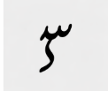

# urdu-digit-recognition

   

A CNN-based web application that recognizes handwritten Urdu digits (0–9) from uploaded images, built with TensorFlow, OpenCV, and Flask.

---

## Features

- Upload an image to recognize a single Urdu digit
- - Draw a digit on a canvas and get instant prediction
  - - Multi-digit recognition from a single image
    - - Confidence score displayed for each prediction
      - - Urdu language UI
       
        - ---

        ## Demo Screenshots

        

        ---

        ## Project Structure

        ```
        urdu-digit-recognition/
        ├── app.py               # Flask backend & CNN inference logic
        ├── index.html           # Frontend UI (Urdu language)
        ├── style.css            # Stylesheet
        ├── script.js            # Frontend JavaScript
        ├── requirements.txt     # Python dependencies
        ├── uploads/             # Temporary uploaded images (auto-created)
        └── README.md
        ```

        ---

        ## Model Download

        The trained model file (`urdu_cnn_model.h5`) is too large for GitHub. Download it from Google Drive and place it in the project root:

        **[Download urdu_cnn_model.h5 from Google Drive](https://drive.google.com/uc?export=download&id=1mje13D6_ScmMt4qv_F5e7WChTmctKD0Q)**

        After downloading, place it here:
        ```
        urdu-digit-recognition/
        └── urdu_cnn_model.h5   <-- place it here
        ```

        ---

        ## Installation & Setup

        ### 1. Clone the repository
        ```bash
        git clone https://github.com/zohacust-debug/urdu-digit-recognition.git
        cd urdu-digit-recognition
        ```

        ### 2. Create a virtual environment (recommended)
        ```bash
        python -m venv venv
        venv\Scripts\activate        # Windows
        # source venv/bin/activate   # Mac/Linux
        ```

        ### 3. Install dependencies
        ```bash
        pip install -r requirements.txt
        ```

        ### 4. Download the model
        Download `urdu_cnn_model.h5` from the link above and place it in the project root folder.

        ### 5. Run the app
        ```bash
        python app.py
        ```

        Open your browser and go to: `http://127.0.0.1:5000`

        ---

        ## Usage

        - **Upload Module** — Upload a `.png`, `.jpg`, or `.jpeg` image of a handwritten Urdu digit
        - - **Canvas Module** — Draw a digit directly on the canvas using your mouse
          - - **Multi-Digit Module** — Upload an image containing multiple Urdu digits for batch recognition
           
            - ---

            ## Requirements

            ```
            Flask==2.3.5
            tensorflow==2.14.0
            numpy
            opencv-python
            pillow
            ```

            ---

            ## Tech Stack

            - **Backend:** Python, Flask
            - - **ML Framework:** TensorFlow / Keras (CNN model)
              - - **Image Processing:** OpenCV, Pillow
                - - **Frontend:** HTML, CSS, JavaScript
                  - - **Language:** Urdu UI (Noto Nastaliq font)
                   
                    - ---

                    ## License

                    This project is licensed under the MIT License. See the [LICENSE](LICENSE) file for details.

                    ---

                    ## Author

                    **zohacust-debug** — [GitHub Profile](https://github.com/zohacust-debug)
